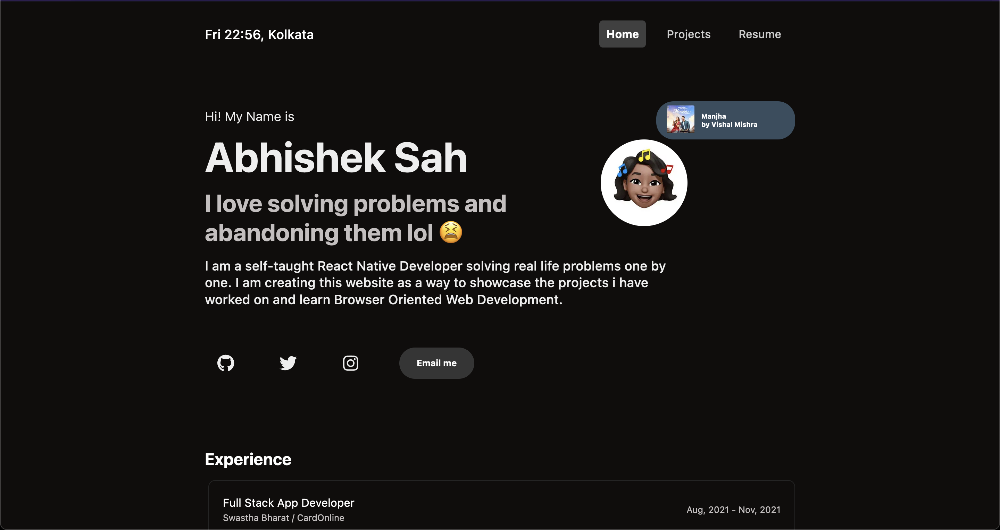

<!--<a href="http://abhii.dev/" target="_blank">abhii.dev</a> -->
# [abhii.dev](https://abhii.dev/)




## Tech Stack

1. Next.JS 12+
2. Typescript
3. Spotify API.

> Hosted on Netlify.
> Domain from Namecheap.

### TODO

- [x] Home Page 🧑🏽‍💻
- [x] Mirrored Repo to github
- [x] Skip to main content (Accessibility)
- [x] Projects Page
  - [x] Aushadhalay
  - [x] OrderGator
- [x] Added Spotify Now Playing
- [ ] Add Animation to loading avatar
- [ ] Blog
- [ ] Accessibility
- [x] Thank you page for pages i drew inspiration from
- [x] Buy a domain
- [x] Publish to said domain using netlify.

## Getting Started

First, run the development server:

```bash
yarn dev
```

Open [http://localhost:3000](http://localhost:3000) with your browser to see the result.
